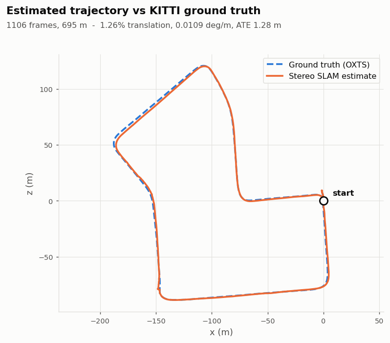
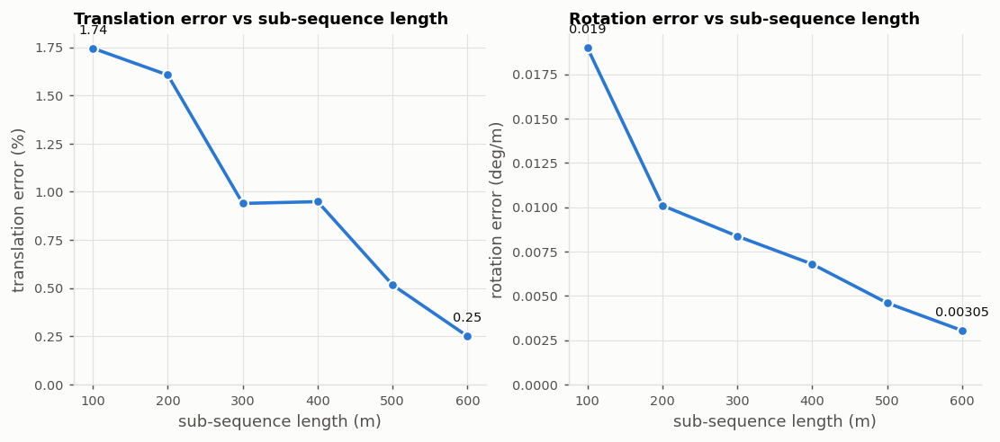
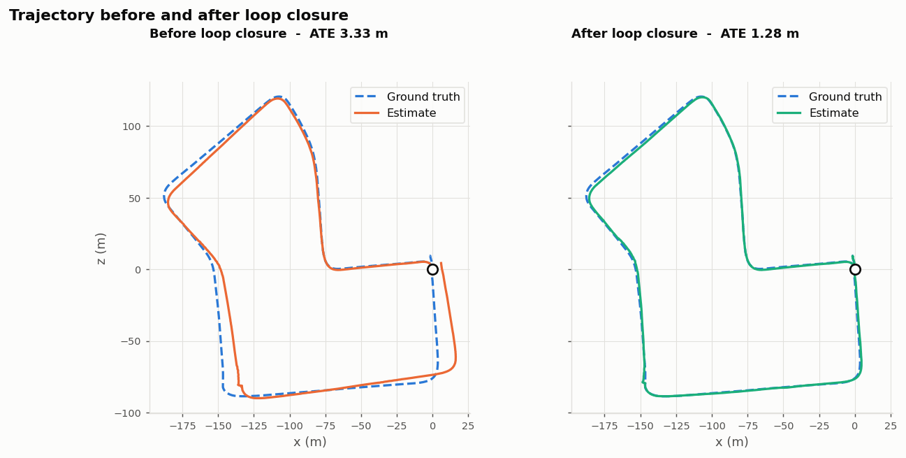
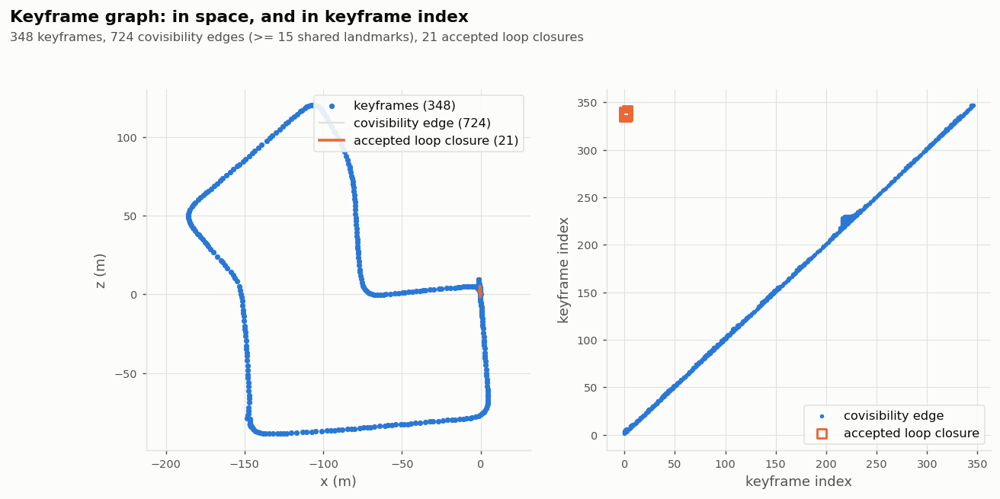
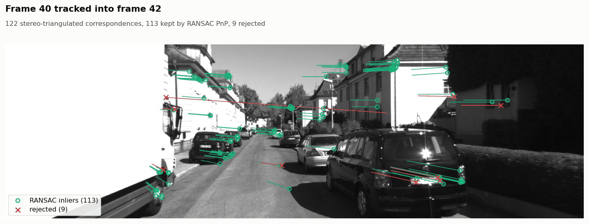
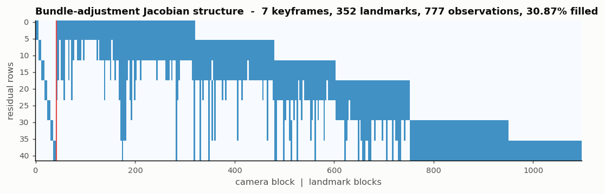

# stereo-visual-slam

A stereo camera moving through a city, no GPS, and the question: **where am I,
and what does the world around me look like?** This is a from-scratch answer to
that question, measured against real KITTI ground truth.




---

## The problem

A robot with a camera and no external positioning has to work out its own
motion from what it sees. Two things make that hard, and neither is the maths.

The first is that **errors compound**. Every frame's motion estimate is a little
wrong, and the pose is the product of all of them. A tenth of a degree of
rotation error per frame is invisible in any single image and puts you tens of
metres off after a lap of a block.

The second is that **wrong data is silent**. Nothing in this pipeline throws an
exception when the map goes bad. Our first full-sequence run scored 13.3%
translation error, and the reason turned out to be three missing lines: every
descriptor match between consecutive keyframes was being turned into a landmark
observation, and roughly half of those matches were wrong. The per-frame pose
estimates were fine throughout -- frame-to-frame steps matched ground truth to a
few centimetres. The damage was done afterwards, by the bundle adjustment, which
was starting from a **40-pixel** reprojection error, arbitrating between
observations that contradicted each other, and resolving the contradiction by
moving keyframes two to four metres. Gating that association on a reprojection
check took the odometry from 13.3% to **2.0%**; loop closure then took it to
**1.26%**. The full story, and the second failure that one was masking, is in
[docs/tuning.md](docs/tuning.md).

Stereo helps with the first problem, because the baseline gives metric depth and
therefore metric scale -- a monocular camera cannot observe how far it moved, only
in which direction. Loop closure helps too, by recognising a place you have
already been and folding the accumulated drift out of the whole trajectory. The
second problem needs instrumentation and gates: check what you are about to
believe, and count what you rejected.

## What this does

- **Reads KITTI properly**, both the raw drive layout and the odometry benchmark
  layout, including the OXTS GPS/IMU records and the projection from
  latitude/longitude into a local metric frame that turns them into a
  ground-truth trajectory.
- **Detects and buckets features** so they span the image rather than clumping
  on the one high-contrast wall in view.
- **Matches stereo along epipolar lines** with a left-right consistency check and
  a depth-uncertainty gate derived from the geometry, not from a tuned constant.
- **Estimates motion** with RANSAC PnP, then refines it with a hand-written
  Gauss-Newton step on SE(3) using analytic Jacobians.
- **Runs windowed bundle adjustment** written from scratch: Levenberg-Marquardt
  over keyframe poses and landmarks, analytic Jacobians, and the Schur complement
  to marginalise the landmarks out.
- **Closes loops** with a bag-of-words vocabulary trained on a held-out slice of
  the sequence, geometric verification by RANSAC PnP, and an SE(3) pose graph with
  a robust kernel that switches a false loop closure off instead of letting it
  fold the map in half.
- **Scores itself with the official KITTI metrics** -- translation error as a
  percentage and rotation error in degrees per metre, averaged over sub-sequences
  of 100 to 800 m -- plus ATE and RPE.

No ORB-SLAM, no OpenVSLAM, no g2o, no GTSAM, no Ceres. OpenCV supplies feature
detection, descriptor matching and the standard geometric solvers; everything
above -- the stereo matcher, the pose refinement, the bundle adjustment, the loop
detector, the pose graph and the metrics -- is in `src/svslam`.

## Quickstart

```bash
pip install -r requirements.txt

# Everything except the dataset-dependent tests runs offline, in under a minute.
python3 -m pytest -q

# Fetch the drive this repository is evaluated on (about 4.1 GB).
python3 tools/fetch_kitti.py --output data/kitti

# Run the pipeline and score it.
python3 benchmarks/run.py \
    --sequence data/kitti/2011_09_30/2011_09_30_drive_0027_sync
```

Or run and evaluate as two steps:

```bash
tools/svslam-run  --sequence data/kitti/2011_09_30/2011_09_30_drive_0027_sync \
                  --output trajectory.txt
tools/svslam-eval --estimate trajectory.txt \
                  --sequence data/kitti/2011_09_30/2011_09_30_drive_0027_sync
```

The dataset is never committed. `tools/fetch_kitti.py` records the exact URLs
and sizes, checks the download is complete, and CRC-tests the archive before
extraction -- a truncated 4 GB transfer produces a plausible-looking file that
unzips to a partial drive.

### Worked example

Real output from the command above, on the machine described under
[Results](#results):

```
$ python3 benchmarks/run.py --sequence data/kitti/2011_09_30/2011_09_30_drive_0027_sync
sequence      : data/kitti/2011_09_30/2011_09_30_drive_0027_sync
frames        : 0..1106 of 1106
baseline      : 0.5372 m
focal length  : 707.09 px
machine       : 11th Gen Intel(R) Core(TM) i5-1135G7 @ 2.40GHz, 8 logical cores, Python 3.10.12
vocabulary    : training on 60 held-out frames (200..800 step 10)
                trained in 73.8 s
running pipeline ...
  frame   400  keyframes  129  landmarks  10168  tracked  195
  frame   800  keyframes  251  landmarks  15666  tracked   49

====================================================================
frames processed        : 1106
keyframes               : 348
landmarks               : 21393
mean stereo points/frame: 649.6
mean tracked features   : 163.6
loop closures accepted  : 21
loop gate counters      : {'queries': 347, 'appearance_candidates': 1555, 'rejected_consistency': 1062, 'rejected_few_matches': 467, 'rejected_geometry': 5, 'accepted': 21}
implausible motions cut : 0
translation error       : 1.256 %
rotation error          : 0.01092 deg/m
ATE RMSE                : 1.276 m
RPE (10 frames) trans   : 0.2984 m
ground-truth path       : 694.7 m
estimated path          : 696.6 m

  length (m)   trans err (%)   rot err (deg/m)   segments
  ----------   -------------   ---------------   --------
         100           1.745           0.01899         89
         200           1.606           0.01010         79
         300           0.940           0.00837         58
         400           0.949           0.00679         44
         500           0.517           0.00460         30
         600           0.250           0.00305         17

runtime                 : 326.6 s  (0.295 s/frame)
  io                  :     10.4 ms/frame
  features            :     17.8 ms/frame
  stereo              :    145.6 ms/frame
  tracking            :      7.9 ms/frame
  keyframe            :     39.1 ms/frame
  bundle_adjustment   :     24.3 ms/frame
  loop                :     35.4 ms/frame
  pose_graph          :     14.0 ms/frame
====================================================================

wrote benchmarks/output
```

## Results

Measured on **KITTI raw drive `2011_09_30_drive_0027`** -- the raw-data equivalent
of odometry sequence 07, chosen because the vehicle genuinely returns to within
about ten metres of where it started, so loop closure has something real to
find. Ground truth comes from the drive's own OXTS GPS/IMU records, projected
into a local metric frame and changed into the rectified left camera frame.

Machine: 11th Gen Intel(R) Core(TM) i5-1135G7 @ 2.40GHz, 8 logical cores, Python 3.10.12.

| | |
|---|---|
| frames processed | 1106 (the whole drive) |
| ground-truth path length | 694.7 m |
| estimated path length | 696.6 m |
| keyframes | 348 |
| landmarks | 21393 |
| mean stereo points per frame | 650 |
| mean tracked features per frame | 164 |
| feature spread (normalised entropy) | 0.868 |
| loop closures accepted | 21 |
| loop candidates rejected | 1062 by consistency, 467 by too few matches, 5 by geometry |
| **translation error** | **1.256 %** |
| **rotation error** | **0.01092 deg/m** |
| ATE RMSE | 1.276 m (mean 1.129, median 0.975, max 2.958) |
| RPE over 10 frames | 0.298 m, 0.556 deg |
| runtime | 327 s (0.295 s/frame, single-threaded Python) |

The official KITTI error-vs-length breakdown:

| sub-sequence length (m) | translation error (%) | rotation error (deg/m) | sub-sequences |
|---|---|---|---|
| 100 | 1.745 | 0.01899 | 89 |
| 200 | 1.606 | 0.01010 | 79 |
| 300 | 0.940 | 0.00837 | 58 |
| 400 | 0.949 | 0.00679 | 44 |
| 500 | 0.517 | 0.00460 | 30 |
| 600 | 0.250 | 0.00305 | 17 |



### How this compares to published work

Well-tuned stereo systems on KITTI land around **1%** translation error.
ORB-SLAM2, LIBVISO2 and their descendants report figures in that range across
the benchmark sequences.

This pipeline measures **1.26%** translation error and **0.0109 deg/m** rotation
error on this drive, with an absolute trajectory error of **1.28 m** over 695 m.
That is a respectable result for a from-scratch implementation, and it is the
number we actually measured -- not a best-of-several-runs, and not on a
hand-picked segment. The run is deterministic: three consecutive full-sequence
runs produced identical metrics.

Three honest qualifications on that number:

1. **It is one sequence, not the benchmark.** The published figures are averages
   over eleven training sequences including a motorway run at speed, where
   errors are larger. A single 695 m residential loop is a friendlier test.
2. **The evaluation is against OXTS-derived ground truth**, computed by this
   repository from the raw drive, not against the odometry benchmark's own pose
   files. The two agree closely -- our Mercator and WGS-84 ENU conversions differ
   by 0.054% of path length -- but they are not literally the same numbers.
3. **It is not real time.** 0.29 s per frame in numpy against KITTI's 10 Hz
   capture. The algorithms are the point here; the implementation is not
   optimised.

### Loop closure

Loop closure is what takes this from 2.02% to 1.26%:

| | translation (%) | rotation (deg/m) | ATE RMSE (m) |
|---|---|---|---|
| before loop closure | 2.020 | 0.01125 | 3.331 |
| after loop closure | 1.256 | 0.01092 | 1.276 |



**Precision on this sequence: 21 of 21 accepted loop closures are correct.**
Correct means the two keyframes really were near each other: the ground-truth
distance between them ranges from 0.31 m to 4.58 m, against a 15 m criterion.

The gates did the work. Of 1555 appearance candidates over 347 keyframe queries,
1062 were dropped for failing temporal consistency, 467 for too few usable
descriptor matches, and 5 by RANSAC PnP geometry. That last number is small
because the two gates in front of it filter most of the traffic, which is the
design -- geometric verification is the expensive one and it runs last.

Recall is a different and less comfortable number. The bag-of-words score
separates a true revisit from an unrelated stretch of the same residential
street by only a few percent: measured on this drive, median 0.371 against
0.327, with top-3 retrieval recall of 0.71. Appearance is therefore used to
*rank* candidates, never to decide. What makes the precision perfect is the
geometry.



### What each part is worth

`benchmarks/ablation.py` re-runs the whole sequence with one component disabled
at a time. Loop closure is off in every row, so this isolates the odometry front
and back end; the full-pipeline row here is therefore the *before loop closure*
number above, not the headline one:

| variant | translation (%) | rotation (deg/m) | ATE RMSE (m) | mean tracked | feature spread | s/frame |
|---|---|---|---|---|---|---|
| full pipeline | 2.00 | 0.0112 | 3.26 | 163 | 0.868 | 0.24 |
| no bundle adjustment | 2.17 | 0.0129 | 3.77 | 161 | 0.869 | 0.19 |
| no feature bucketing | 3.13 | 0.0149 | 6.80 | 268 | 0.682 | 0.37 |
| no depth-uncertainty gate | 2.65 | 0.0209 | 6.71 | 185 | 0.868 | 0.24 |
| no motion plausibility gate | 2.00 | 0.0112 | 3.26 | 163 | 0.868 | 0.22 |
| no landmark association gate | 7.35 | 0.0380 | 21.65 | 176 | 0.868 | 0.26 |

Reading that table honestly:

- **The landmark association gate is worth more than everything else combined.**
  Without it, 2.00% becomes 7.35% and the ATE goes from 3.3 m to 21.7 m.
- **Bucketing earns its place**: 2.00% -> 3.13%, and it is *faster*, because it
  hands the stereo matcher 163 well-spread features instead of 268 clumped ones.
  The measured spread entropy drops from 0.868 to 0.682 when it is off.
- **Bundle adjustment helps, modestly**, on this sequence: 2.00% -> 2.17%. The
  frontend is already good, and a seven-keyframe window cannot fix drift at the
  scale a loop closure does.
- **The depth-uncertainty gate is worth about two thirds of a percent** of
  translation error, and removing it nearly doubles the rotation error.
- **The motion plausibility gate changes nothing here.** With the association
  bug fixed it never fires on this drive. It stays in because the failure it
  guards against is real and was measured (see [docs/tuning.md](docs/tuning.md)),
  but this sequence does not demonstrate it, and the table says so.

### Where the time goes

| stage | ms per frame |
|---|---|
| io | 10.4 |
| features | 17.8 |
| stereo | 145.6 |
| tracking | 7.9 |
| keyframe | 39.1 |
| bundle adjustment | 24.3 |
| loop | 35.4 |
| pose graph | 14.0 |

Sparse stereo dominates: a sum-of-absolute-differences search plus a
left-right re-search over roughly 650 surviving features per frame, in numpy.






## How it works

```
KITTI raw drive or odometry sequence
  |
  |  svslam.dataset.kitti      calibration, stereo frames, OXTS -> ground truth
  v
per frame:  left, right (rectified greyscale)
  |
  |  svslam.frontend.features  ORB + spatial bucketing
  v  ~1500 keypoints, spread across a 5 x 12 grid
  |
  |  svslam.frontend.stereo    SAD along epipolar rows, sub-pixel parabola fit,
  v                            left-right check, depth-uncertainty gate
  ~650 metric 3D points in the camera frame
  |
  |  svslam.frontend.odometry  match to the reference keyframe,
  v                            RANSAC PnP -> motion-only Gauss-Newton
  T_cw for this frame, or a rejection and the constant-velocity prediction
  |
  +-- not a keyframe: store the pose relative to its reference keyframe
  |
  +-- keyframe:
        svslam.map                link landmarks, triangulate new ones, cull
        svslam.backend.ba         windowed Levenberg-Marquardt + Schur complement
        svslam.loop.detector      bag-of-words query -> RANSAC PnP verification
        svslam.backend.posegraph  SE(3) optimisation, DCS robust kernel
        svslam.map                propagate the correction to the landmarks
```

### Stage by stage

**Features and bucketing.** ORB is asked for three times the final budget, then
a 5 x 12 grid keeps at most 30 per cell, ranked by response. Fewer features
survive and each is individually weaker, but they span the image, and that is
what conditions the pose. `svslam.frontend.features.spatial_spread` measures the
difference so it is a number rather than a claim.

**Sparse stereo.** For each left feature, a sum-of-absolute-differences search
along its epipolar row over the disparity range, refined to sub-pixel by a
parabola through the cost minimum. Four filters follow, in order: uniqueness
against the runner-up, an absolute cost ceiling, a left-right consistency
re-search, and a depth-uncertainty gate.

That last one matters more than it looks. `Z = fx b / d`, so
`sigma_Z = Z^2 sigma_d / (fx b)` -- uncertainty grows with the *square* of depth.
With KITTI's numbers a point at 10 m has about 6 cm of depth uncertainty and the
same point at 80 m has about 4 m. Far points look like perfectly good matches
and will drag a PnP solution around by metres. Because `sigma_Z / Z = sigma_d / d`
exactly, the rejection threshold is a closed form rather than a tuned constant.

**Odometry.** Correspondences come from matching the current frame's descriptors
against the *reference keyframe*, not the previous frame -- chaining frame to
frame compounds error at frame rate. RANSAC PnP finds the consensus set; the
pose that is actually used comes from a Gauss-Newton refinement over those
inliers with a Huber kernel, solving `(J^T W J) d = -J^T W r` and applying the
left update `T <- exp(d) T`. Then a plausibility gate: an estimate implying more
than 4 m or 0.35 rad between two consecutive frames is discarded in favour of the
constant-velocity prediction, and a keyframe is forced so the local map is
re-seeded from that frame's own stereo pair.

**Keyframes and landmark association.** A keyframe is inserted when tracking
weakens, when the view has changed enough, or after a frame budget -- rotation is
weighted more heavily than translation, because a turn destroys overlap with the
reference keyframe far faster than driving straight does. Landmarks are carried
into the new keyframe **only if they project into it within the same threshold
RANSAC used**. That check is three lines and it is worth more than any other
three lines in the repository; without it, roughly half the associations are
wrong, bundle adjustment starts from a forty-pixel reprojection error, and it
resolves the contradiction by moving keyframes metres out of place.

**Bundle adjustment.** The normal equations are an arrowhead matrix -- a
block-diagonal camera block `U`, a block-diagonal landmark block `V`, and a
sparse coupling `W`. The Schur complement marginalises the landmarks:

```
S = U - W V^-1 W^T          S dc = -(b_c - W V^-1 b_p)
dp_j = V_j^-1 (-b_p_j - sum_i W_ij^T dc_i)
```

For a 7-keyframe window over 3000 landmarks the direct system is
21042 x 21042 and the reduced one is 42 x 42. `solve_dense` implements the
direct solve anyway, purely so the tests can assert the two give the same answer.

**Loop closure.** Three gates in series: bag-of-words appearance similarity
against keyframes outside a temporal exclusion window; temporal consistency, so
a single-frame appearance spike is not enough; and RANSAC PnP between the
candidate keyframe's landmarks *in its own camera frame* and the query frame's
features. Using the candidate's own frame rather than the world frame means a
loop can still be verified after the global map has drifted by metres. The
rejection count at each gate is reported, because a detector that never rejects
anything is not being careful, it is being lucky.

**Pose graph.** Nodes are keyframe poses, edges are relative transforms, the
error is `log(Z^-1 T_i^-1 T_j)`, and the Jacobians are analytic and checked
against central differences. A false loop closure is the failure that ends SLAM
systems, so loop edges get a Dynamic Covariance Scaling kernel, applied after a
warm-up and annealed downwards. The order matters: a *correct* loop closure has
a large residual at the moment it is added -- that residual is the drift it exists
to remove -- so switching the kernel on immediately would reject exactly the edges
that matter.

## What is hard about this

**Scale drift in monocular.** One camera cannot observe how far it travelled,
only in which direction. `estimate_essential_motion` returns a unit translation
by construction. Any monocular system has to get scale from somewhere else and
whatever it uses will drift. Stereo removes the problem, which is the reason this
package is stereo.

**Far-point depth uncertainty.** Covered above: quadratic in depth, invisible in
the image, poisonous to the solver. The gate is derived, not guessed.

**Feature clumping.** Corner detectors pile onto the most textured region in
view. The pose then has one well-constrained direction and several soft ones,
and the estimate wanders while every diagnostic looks fine.

**Dynamic objects.** A car moving with you is a rigid set of features whose
motion is consistent -- with the wrong thing. RANSAC removes them while they are a
minority, which they usually are on KITTI's residential streets. In heavy
traffic, or behind a bus, they are not a minority, and this pipeline has no
semantic segmentation to fall back on. That is a real limitation, not a solved
problem.

**One false loop closure destroying the map.** Least squares will fold a
trajectory in half to satisfy a strong, confident, wrong constraint, and unlike a
bad odometry step there is no averaging that saves you. `tests/test_robust_kernel.py`
injects one and checks the map survives.

**A single bad frame.** A vehicle nearly stationary in a turn leaves few
matches; RANSAC finds a small consensus set among them and returns a pose
implying a twelve-metre jump in one tenth of a second. We measured exactly that
at frame 637 of this drive: a 30 degree rotation error in one frame, in a 100 m
window that came out at 15.2 m of error while every other window was between
0.25 m and 1.7 m. `is_plausible_motion` refuses it. Honest postscript: once the
landmark association bug above was fixed, that gate stops firing on this
sequence entirely -- the ablation table shows it making no difference here. It
stays in because the failure is real and the guard costs a norm and an arccos.

## Tests

```
$ python3 -m pytest -q
196 passed, 3 skipped in 22.95s
```

20 test files. Every test is deterministic and offline; the three skipped ones
need the KITTI download.

If you have ROS 2 installed system-wide, its `launch_testing` pytest plugin is
auto-loaded and fails hook validation against modern pytest, which looks like a
failure in this repository and is not. Disable plugin autoloading:

```
$ PYTEST_DISABLE_PLUGIN_AUTOLOAD=1 python3 -m pytest -q
```

The KITTI-dependent tests are enabled by pointing `SVSLAM_KITTI` at a sequence
directory:

```
$ SVSLAM_KITTI=data/kitti/2011_09_30/2011_09_30_drive_0027_sync python3 -m pytest -q
199 passed in 24.53s
```

What the suite actually proves, rather than merely exercises:

| check | file |
|---|---|
| SE(3) exp/log round trip, including near zero and near pi | `test_se3.py` |
| SE(3) left Jacobian against central differences | `test_se3.py` |
| Reprojection Jacobians (pose and point, mono and stereo) against central differences | `test_jacobians.py` |
| Triangulation recovers a known 3D point from synthetic stereo | `test_triangulation.py` |
| Depth uncertainty is quadratic in depth; the disparity floor is a closed form | `test_triangulation.py` |
| Block matching recovers a known constant disparity; far points are rejected | `test_stereo_matching.py` |
| PnP recovers a known pose, and survives a 30% outlier fraction | `test_pnp.py` |
| Gauss-Newton refinement converges and resists gross outliers | `test_pnp.py` |
| Schur complement solve equals the dense solve | `test_schur.py` |
| Bundle adjustment lowers cost monotonically and recovers the geometry | `test_schur.py` |
| Pose-graph edge Jacobians against central differences | `test_posegraph.py` |
| A robust kernel switches off an injected false loop closure and the map survives | `test_robust_kernel.py` |
| The KITTI metric reproduces a hand-computed value on a synthetic trajectory | `test_kitti_metrics.py` |
| Bucketing spreads features measurably better than not bucketing | `test_features.py` |
| Calibration parsing round-trips, for both dataset layouts | `test_calibration.py` |
| The plausibility gate rejects the impossible and passes motorway speed | `test_odometry_gates.py` |
| The pipeline recovers metric scale end to end on a rendered stereo sequence | `test_pipeline.py` |

## Limitations

**Not real time.** Roughly a third of a second per frame in single-threaded
Python against a 10 Hz capture. The stereo search and the bundle adjustment are
numpy, not C++, and there is no threading. This repository is about getting the
algorithms right and measuring them honestly, not about throughput.

**One sequence, not the benchmark.** Everything reported here is measured on
KITTI raw drive `2011_09_30_drive_0027`. The odometry benchmark averages over
eleven sequences including a motorway run where the vehicle is fast, the scene
is far away and stereo depth is at its worst. Expect worse numbers there.

**No IMU.** OXTS records are used only as ground truth. A visual-inertial system
would be far more robust through the exact failure this pipeline has to gate
against -- a fast turn with few matches -- because the IMU still knows what the
rotation was.

**No dynamic-object handling.** RANSAC removes moving features while they are a
minority. Following a bus, or waiting at a busy junction, they will not be, and
there is no semantic segmentation here to fall back on.

**Landmarks are only carried forward one keyframe at a time.** A landmark is
associated into a new keyframe only from the immediately preceding keyframe, so
a feature that leaves view and comes back becomes a new landmark. This costs map
compactness and it is why the covisibility graph is effectively a chain. A
proper map-point projection search against the whole local map would fix it.

**The bag-of-words vocabulary is small and flat.** One thousand words from a
single level of k-means in Hamming space, against DBoW2's million-word tree.
Measured top-3 retrieval recall on this drive is 0.71, so appearance ranks
candidates and geometry decides. That works here; on a longer sequence with more
places to confuse, it would need the hierarchical vocabulary.

**Loop closure is demonstrated on one revisit.** This drive contains a single
place the vehicle returns to. Twenty-one accepted closures, all correct, is a
real result and it is also a small sample. A sequence with several revisits, or
with two visually similar streets, would test the false-positive behaviour much
harder than this one does. The robust kernel that would catch such a failure is
tested against an injected false loop closure in `tests/test_robust_kernel.py`,
not against one this detector produced -- because on this sequence it produced
none.

**Rolling shutter and rectification are taken on faith.** KITTI ships rectified
images and this pipeline trusts them. Feed it an unrectified or a rolling-shutter
pair and the epipolar assumption in the stereo matcher is simply wrong.

**The monocular path is a fallback, not a system.** `estimate_essential_motion`
recovers rotation and a translation *direction*. There is no scale estimation
behind it, because doing that properly is a different project.

## Repository layout

```
src/svslam/
  se3.py                  SE(3)/SO(3) exp, log, adjoint, left Jacobians
  reprojection.py         residuals and analytic Jacobians
  map.py                  keyframes, landmarks, covisibility, culling
  pipeline.py             the whole thing wired together
  viz.py                  the figures in this README
  config.py               YAML -> PipelineConfig
  dataset/  kitti.py, geodesy.py
  frontend/ features.py, stereo.py, odometry.py
  backend/  ba.py, posegraph.py
  loop/     vocabulary.py, detector.py
  evaluation/ kitti_metrics.py
tools/      fetch_kitti.py, svslam-run, svslam-eval
benchmarks/ run.py, ablation.py, output/
config/     kitti_raw.yaml, kitti_odometry.yaml
docs/       architecture.md, kitti_metrics.md, tuning.md
tests/      20 files
```

[`docs/architecture.md`](docs/architecture.md) covers the frame conventions and
why bundle adjustment and the pose graph use opposite perturbation conventions.
[`docs/kitti_metrics.md`](docs/kitti_metrics.md) covers the metric definition and
the three details that change the answer.
[`docs/tuning.md`](docs/tuning.md) records what we measured while tuning,
including the two bugs that between them cost twelve percentage points and how
they were found.

## Related work

Part of a set of robotics repositories:

| repo | what it is |
|---|---|
| [lidar-slam-toolkit](https://github.com/Pratyush150/lidar-slam-toolkit) | the LiDAR side of the same problem: LIO-SAM and Cartographer configuration plus extrinsics, time-sync and drift diagnostics |
| [pose-graph-slam](https://github.com/Pratyush150/pose-graph-slam) | the back-end on its own, as a standalone pose-graph optimiser |
| [drone-control-toolkit](https://github.com/Pratyush150/drone-control-toolkit) | PID/LQR/EKF control and estimation with a simulation harness |
| [jetson-realtime-detection](https://github.com/Pratyush150/jetson-realtime-detection) | real-time detection and tracking tuned for Jetson and edge boards |
| [px4-mavlink-companion](https://github.com/Pratyush150/px4-mavlink-companion) | MAVLink bridge, stale-telemetry watchdog, offboard control |

## License

MIT. Copyright (c) 2026 Pratyush Vatsa.

The KITTI dataset is distributed by Karlsruhe Institute of Technology and
Toyota Technological Institute at Chicago under CC BY-NC-SA 3.0 and is not
redistributed here.
